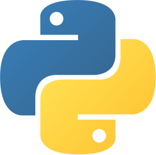
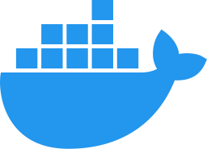
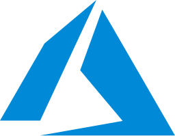

### Hi there, I'm Souheil Ben Slama 👋 

 

## I am a Software Engineering student at INSAT. I have always been passionate about new technologies and always open to new opportunities. 

- 🌱 I’m currently learning kubernetes and Go language 

 
<!--
**souheilbenslama/souheilbenslama** is a ✨ _special_ ✨ repository because its `README.md` (this file) appears on your GitHub profile.

Here are some ideas to get you started:

- 🔭 I’m currently working on ...

- 👯 I’m looking to collaborate on ...
- 🤔 I’m looking for help with ...
- 💬 Ask me about ...
- 📫 How to reach me: ...
- 😄 Pronouns: ...
- ⚡ Fun fact: ...
-->

## Languages and Tools:

